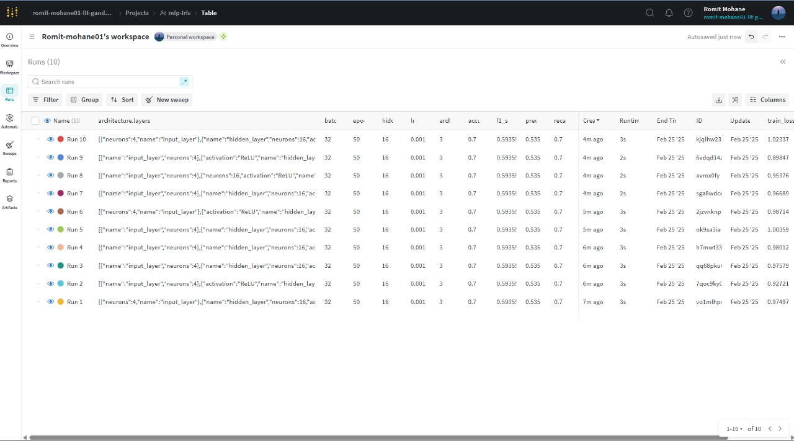
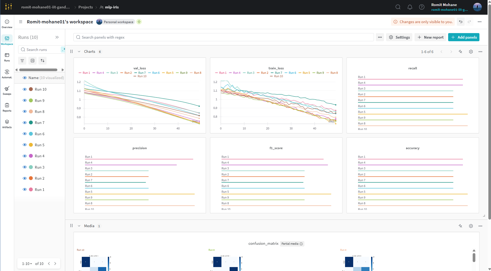
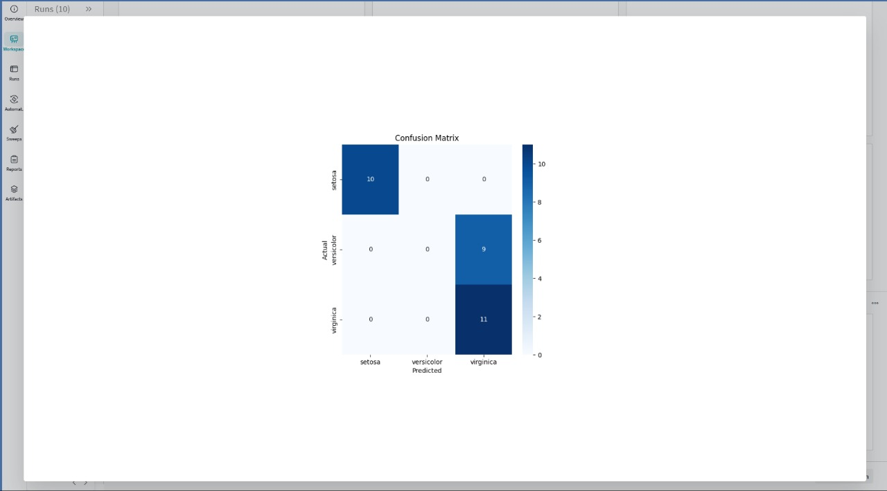
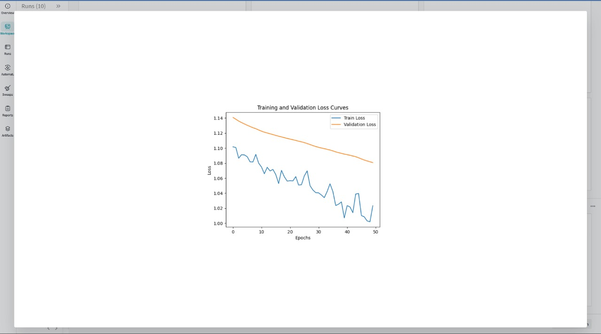

# STTAI-Assignment6-Reproducibility-HPO

### [GitHub Link](https://github.com/Reckadon/STTAI-Assignment6-Reproducibility-HPO)

**_Team 25_**  
Members:

| Name               | Roll Number |
| ------------------ | ----------- |
| Romit Mohane       | 23110279    |
| Rudra Pratap Singh | 23110281    |

---

## Introduction

The goal of this assignment is to learn about experiment tracking, version control, and reproducibility in machine learning workflows. You will set up experiment tracking using Weights and Biases.

### Section 1: MLP Model Implementation & Experiment Tracking

> #### In file [`Section1.ipynb`](./Section1.ipynb)
>
> _Screenshots_  
> Model architecture, Hyperparams, logged metrics  
> 
> Final Evalutation results
> 
> Confusion matrix visualisation
> 
> Training and Validation loss curves
> 
