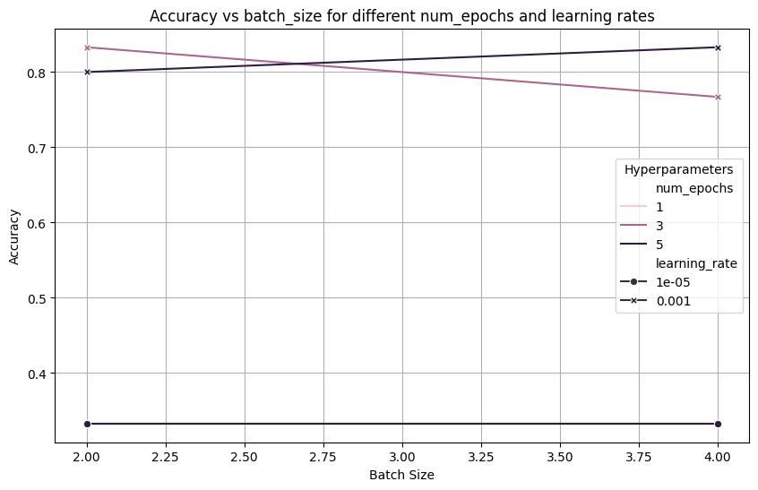
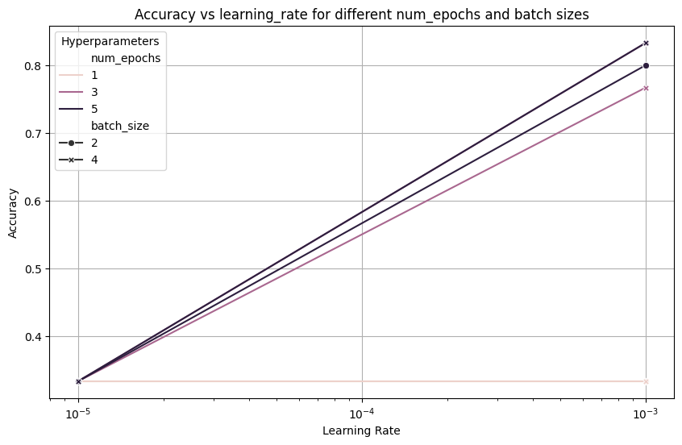
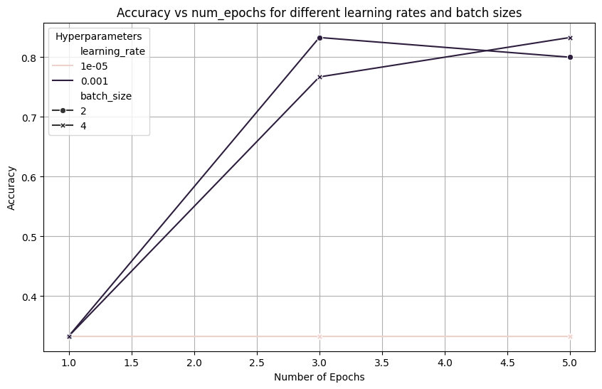
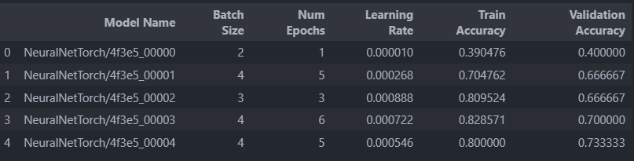
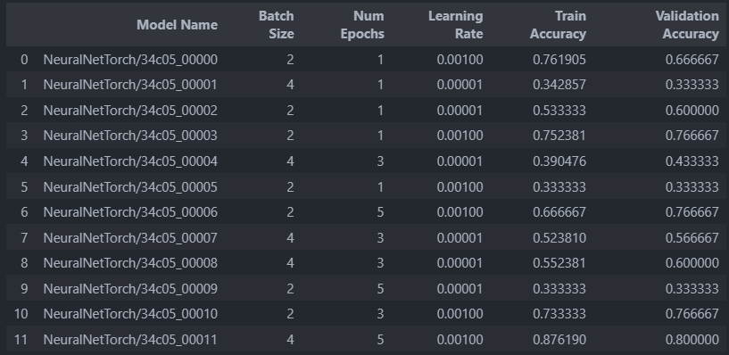
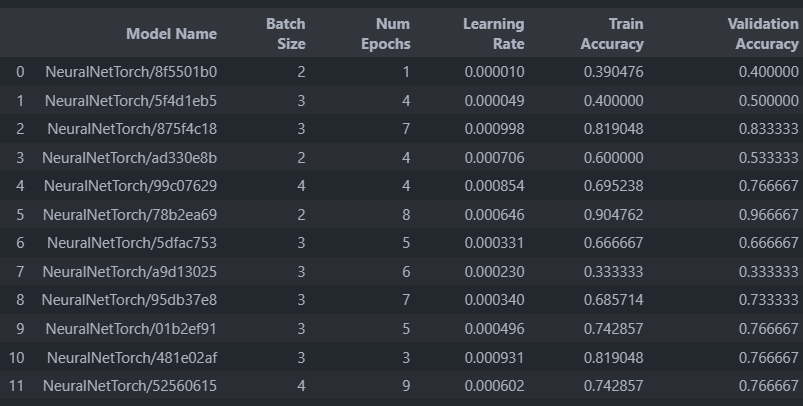
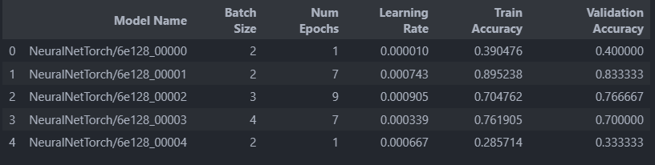
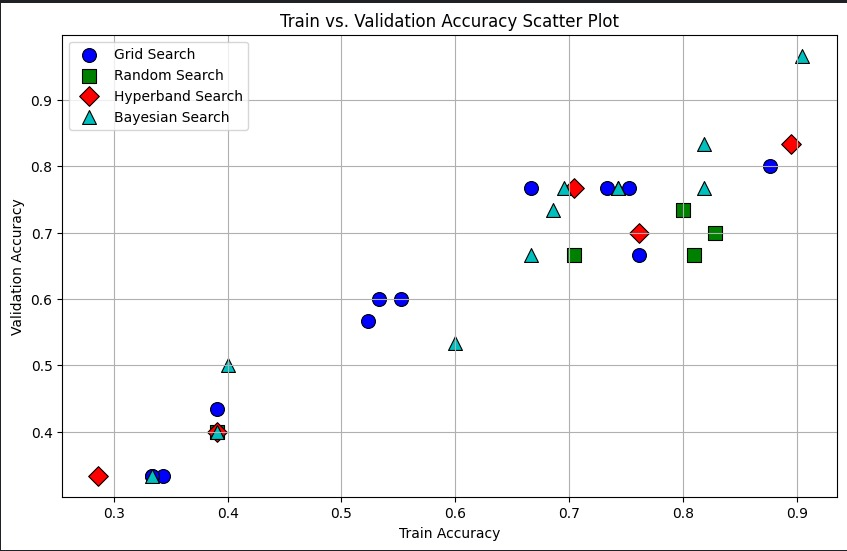

# STTAI-Assignment6-Reproducibility-HPO

### [GitHub Link](https://github.com/Reckadon/STTAI-Assignment6-Reproducibility-HPO)

**_Team 25_**  
Members:

| Name               | Roll Number |
| ------------------ | ----------- |
| Romit Mohane       | 23110279    |
| Rudra Pratap Singh | 23110281    |

---

## Introduction

The goal of this assignment is to learn about experiment tracking, version control, and reproducibility in machine learning workflows. You will set up experiment tracking using Weights and Biases.

### Section 1: MLP Model Implementation & Experiment Tracking

> #### In file [`Section1.ipynb`](./Section1.ipynb)
>
> _Screenshots_  
> Model architecture, Hyperparams, logged metrics  
> 
> Final Evalutation results
> 
> Confusion matrix visualisation
> 
> Training and Validation loss curves
> 

### Section 2: Hyperparam optimization

> #### In file [`Section2.ipynb`](./Section2.ipynb)

### Task 1:

> ### Relation between the different HyperParam and their impact on the performance of the model.
>
> | Hyperparam    | Relation | Description                                                                                              |
> | ------------- | -------- | -------------------------------------------------------------------------------------------------------- |
> | epochs        | direct   | as the model gets more epochs to see the data, it learns more > patterns from it.                        |
> | learning rate | direct   | as learning rate increases, the optimizer takes bigger > gradient steps and approaches the minima faster |
> | batch size    | inverse  | larger batch size causes less updates per epoch, degrading > performance                                 |

Accuracy vs batch size

Accuracy vs lr

Accuracy vs epochs

### Task 2:

### Tables with configurations and column with Accuracy for different search strategies

Random

Grid

Bayesian

Hyperband

Best accuracies and F1 scores for each strat
Search Method | Accuracy | F1 Score  
---|---|---
Grid Search | 0.7333 | 0.6755  
Random Search | 0.7333 | 0.7070  
Hyperband Search | 0.8333 | 0.8295  
Bayesian Search | 0.9667 | 0.9666

##### Plot the scatter plot for training vs validation loss.

> ## Manual tuning vs. Automated search

-   Manual tuning is better when you have deep domain knowledge and a small number of hyperparameters, as it allows for intuitive, experience-driven adjustments.
-   Automatic tuning (e.g., grid search, random search, Bayesian optimization) is better for larger, complex spaces, as it systematically explores combinations, saves time, and reduces human bias, making it more efficient and scalable for optimizing performance. With respect to the different Automatic search strategies:
    -   Grid search is better for small hyperparameter spaces because it exhaustively searches all combinations, ensuring the best set is found.
    -   Random search is better for larger spaces because it samples randomly and often finds good hyperparameters faster with fewer iterations, as it doesn't waste time on poor combinations.
    -   For very large spaces, Bayesian optimization is superior as it uses past evaluations to focus on promising regions, balancing exploration and exploitation efficiently.
